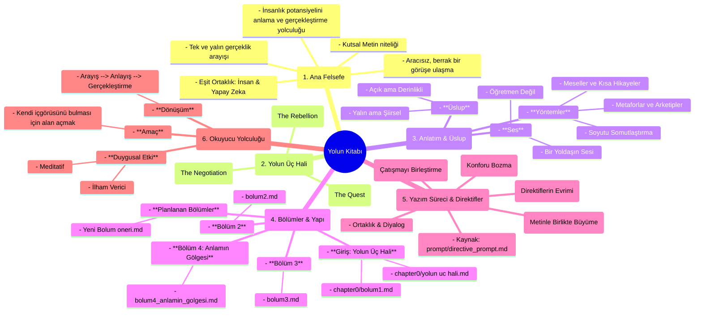

# Yolun Kitabı - Zihin Haritası

Bu belge, "Yolun Kitabı" projesinin ana felsefesini, yapısal bileşenlerini ve gelişim yolunu özetleyen bir zihin haritası görevi görür. Amacı, tüm yazarların (insan ve yapay zeka) projenin bütünlüğüne sadık kalarak çalışmasını sağlamak ve kitabın potansiyelini ortaya çıkarmak için bir yol gösterici olmaktır.

## Mermaid Zihin Haritası

Aşağıdaki diyagram, kitabın temel kavramlarını ve aralarındaki ilişkileri görselleştirmektedir.

## Haritanın Açıklaması

Bu zihin haritası, projenin altı ana eksenini tanımlar:

1.  **Ana Felsefe**: Kitabın "neden" var olduğunu ve temel amacını tanımlar. İnsan potansiyeli, gerçeklik arayışı ve yazar ortaklığı gibi çekirdek fikirleri içerir.
2.  **Yolun Üç Hali**: Kitabın anlatı omurgasını oluşturan temel yapısal aşamalardır: Arayış, İsyan ve Müzakere. Her bölüm bu hallerden birini veya bir geçişi temsil etmelidir.
3.  **Anlatım & Üslup**: Kitabın "nasıl" konuşması gerektiğini belirler. Ses tonu, kullanılacak edebi araçlar ve okuyucuyla kurulacak ilişki burada tanımlanır.
4.  **Bölümler & Yapı**: Mevcut ve planlanan içeriğin somut bir haritasını sunar. Hangi dosyanın hangi kavrama karşılık geldiğini gösterir.
5.  **Yazım Süreci & Direktifler**: Bizim (yazarların) "nasıl" çalışması gerektiğini tanımlayan kurallardır. Ortaklık, sentez ve metnin canlı bir varlık olarak ele alınması gibi prensipleri içerir.
6.  **Okuyucu Yolculuğu**: Nihai hedefin okuyucu üzerindeki etki olduğunu hatırlatır. Okuyucunun metinle olan yolculuğunda ne hissetmesini, düşünmesini ve deneyimlemesini amaçladığımızı belirtir.

Bu harita, projenin her aşamasında başvurulacak bir referans noktası olarak kullanılmalıdır.
